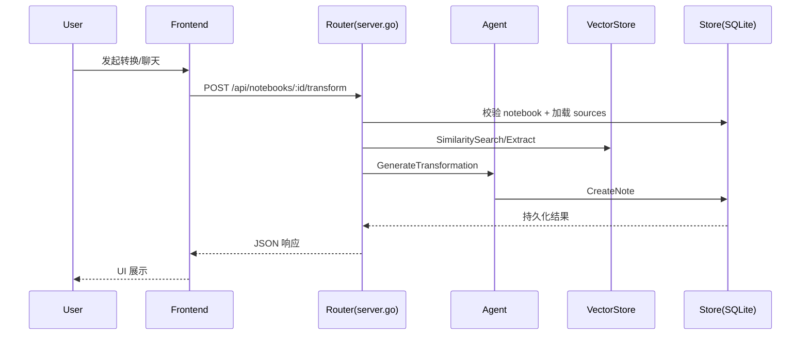
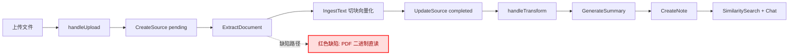

# 项目功能与流程梳理报告
<!-- markdownlint-disable MD013 -->

## 1. 项目概况

- 项目名称：Notex（隐私优先的 NotebookLM 开源替代）
- 技术栈：Go 后端 + Gin + SQLite + 原生 JavaScript 前端
- 启动模式：`-server`（HTTP 服务）与 `-ingest`（离线导入）
- 鉴权模型：JWT（`/api`）+ HashID（`/api/v1`）+ Public Token（`/public`）
- 核心业务：内容采集、解析切块、向量检索、RAG 对话、转换生成、公开分享

### 1.1 入口文件

- 服务入口：`main.go`
- 后端入口：`backend/server.go` 中 `NewServer()`、`setupRoutes()`
- 配置入口：`backend/config.go` 中 `LoadConfig()`、`ValidateConfig()`
- 前端入口：`backend/frontend/index.html`
- 前端核心逻辑：`backend/frontend/static/app.js`

### 1.2 核心模块

- `Server`：路由与请求编排
- `Store`：SQLite 数据持久化（用户/笔记本/来源/笔记/会话）
- `VectorStore`：内容提取、切块、索引、检索
- `Agent`：RAG、transform、overview 生成
- `Auth`：OAuth + JWT 登录态管理

### 1.3 第三方依赖（核心）

| 依赖 | 版本 | 作用 |
| --- | --- | --- |
| `github.com/gin-gonic/gin` | `v1.10.0` | HTTP 框架 |
| `github.com/golang-jwt/jwt/v5` | `v5.3.0` | JWT 鉴权 |
| `github.com/tmc/langchaingo` | `v0.1.14` | LLM 与向量工作流 |
| `modernc.org/sqlite` | `v1.42.2` | 本地数据库 |
| `google.golang.org/genai` | `v1.40.0` | Gemini 接入 |
| `golang.org/x/oauth2` | `v0.34.0` | OAuth 登录 |
| `github.com/joho/godotenv` | `v1.5.1` | 环境变量加载 |

### 1.4 配置清单（关键）

- LLM：`LLM_PROVIDER`、`OPENAI_API_KEY`、`OPENAI_BASE_URL`、`OPENAI_MODEL`、`OLLAMA_BASE_URL`、`OLLAMA_MODEL`、`GOOGLE_API_KEY`
- 服务：`SERVER_HOST`、`SERVER_PORT`、`MAX_UPLOAD_SIZE`
- 存储：`VECTOR_STORE_TYPE`、`SQLITE_PATH`、`STORE_TYPE`、`STORE_PATH`
- RAG：`MAX_SOURCES`、`CHUNK_SIZE`、`CHUNK_OVERLAP`、`MAX_CONTEXT_LENGTH`
- 文档：`ENABLE_MARKITDOWN`
- 音频：`ENABLE_VOSK_TRANSCRIBER`、`VOSK_MODEL_PATH`
- 鉴权：`JWT_SECRET`、`GITHUB_*`、`GOOGLE_*`
- 功能：`ALLOW_MULTIPLE_NOTES_OF_SAME_TYPE`、`ENABLE_TEST_MODE`

## 2. 目录结构

> 按“前端 / 后端 / 脚本 / 文档 / 测试”维度分类（递归扫描当前仓库）。

```text
notex/
  前端/
    backend/frontend/index.html
    backend/frontend/favicon.svg
    backend/frontend/static/app.js
    backend/frontend/static/style.css

  后端/
    main.go
    backend/server.go
    backend/store.go
    backend/vector.go
    backend/agent.go
    backend/auth.go
    backend/middleware.go
    backend/config.go
    backend/types.go
    backend/cache.go
    backend/memory.go
    backend/prompt.go
    backend/gemini.go
    backend/glm_image.go
    backend/z_image.go
    backend/infograph_styles.go
    backend/utils.go

  脚本/
    Makefile
    .github/workflows/go.yml
    .goreleaser.yaml
    .gitignore
    notex.code-workspace

  文档/
    README.md
    README_CN.md
    README_zh-tw.md
    CHANGELOG.md
    docs/API.md
    docs/AUDIO_TRANSCRIPTION.md
    docs/note.png
    docs/note2.png
    docs/system/项目功能与流程梳理报告.md
    docs/system/system_sequence.drawio.xml
    docs/system/dataflow_upload.drawio.xml
    docs/system/issue_list.csv
    docs/system/flow_review_record.md

  测试/
    当前未发现 *_test.go
```

## 3. 功能清单

### 3.1 用户端

| 功能名称 | 描述 | 输入 | 输出 | 触发条件 | 入口文件 | 核心方法 | 依赖服务 | 权限要求 | 状态 |
| --- | --- | --- | --- | --- | --- | --- | --- | --- | --- |
| 登录与会话初始化 | OAuth 登录并初始化用户态 | OAuth 回调、JWT | 用户信息、登录态 | 打开页面或点击登录 | `auth.go` `app.js` | `HandleLogin()` `HandleCallback()` `initAuth()` | OAuth Provider、Store | 匿名可发起 | 正常 |
| 笔记本管理 | 增删改查笔记本 | 名称、描述 | 笔记本对象列表 | 用户操作卡片/表单 | `server.go` `app.js` | `handleListNotebooks()` `handleCreateNotebook()` | Store | JWT/HashID | 正常 |
| 来源管理 | 文件/文本/URL 新增与删除 | 文件、文本、URL | Source 记录、处理状态 | 提交来源 | `server.go` `vector.go` | `handleAddSource()` `ExtractDocument()` `ExtractFromURL()` | Store、VectorStore、markitdown、yt-dlp、vosk | JWT/HashID | 存在缺陷 |
| 来源状态轮询 | 上传后轮询进度 | source_id | 状态进度 | 上传后自动轮询 | `server.go` `app.js` | `handleGetSourceByID()` `pollSourceStatus()` | Store | JWT/HashID | 正常 |
| 内容转换生成 | 生成摘要/FAQ/学习指南等 | type、prompt、source_ids | Note 内容 | 点击转换卡片 | `server.go` `agent.go` | `handleTransform()` `GenerateTransformation()` | Agent、LLM、Store | JWT/HashID | 存在缺陷 |
| 聊天与会话 | RAG 问答与多会话管理 | message、session_id | answer、sources、messages | 发送消息 | `server.go` `agent.go` `store.go` | `handleChat()` `Chat()` `AddChatMessage()` | Agent、VectorStore、Store | JWT/HashID | 正常 |
| 笔记本概览 | 自动生成摘要和关键问题 | notebook_id | overview JSON | 切换 notebook | `server.go` `agent.go` | `handleNotebookOverview()` `GenerateNotebookOverview()` | Agent、Store | JWT/HashID | 正常 |
| 公开分享 | 设置公开并匿名访问 | notebook_id/public_token | 公开链接与内容 | 点击分享或访问链接 | `server.go` `app.js` | `handleSetNotebookPublic()` `handleGetPublicNotebook()` | Store | 所有者可写，匿名可读 | 正常 |
| 资源预览 | PDF/图片/音频/网页预览 | source/file token | 可视化预览 | 点击来源卡片 | `server.go` `app.js` | `handleServeFile()` `fetchSource()` | 文件系统、浏览器能力 | JWT 或公开 token | 待确认 |

### 3.2 管理端（运维能力）

> 项目无独立后台管理 UI，以下按“系统管理能力”归类。

| 功能名称 | 描述 | 输入 | 输出 | 触发条件 | 入口文件 | 核心方法 | 依赖服务 | 权限要求 | 状态 |
| --- | --- | --- | --- | --- | --- | --- | --- | --- | --- |
| 健康检查 | 返回服务状态 | 无 | health JSON | 调用健康接口 | `server.go` | `handleHealth()` | Server | 内部 API 鉴权 | 正常 |
| 配置下发 | 返回前端能力配置 | 无 | config JSON | 前端初始化 | `server.go` | `handleConfig()` | Config | JWT/HashID | 正常 |
| 审计日志 | 记录访问轨迹 | 请求上下文 | activity log | 所有接口请求 | `middleware.go` `store.go` | `AuditMiddleware()` `LogActivity()` | Store | 中间件自动 | 待确认 |
| Schema 迁移 | 启动时自动迁移 | 现有 DB | 更新后的表结构 | 服务启动 | `store.go` | `initSchema()` `migrate*()` | SQLite | 进程内部 | 正常 |

## 4. 核心流程图

### 4.1 系统级时序图



### 4.2 数据流图



### 4.3 缺陷节点对比

| 缺陷节点 | 当前行为 | 期望行为 |
| --- | --- | --- |
| `VectorStore.ExtractDocument` PDF 降级分支 | `markitdown` 失败后执行 `os.ReadFile(path)` 并直接 `string(bytes)`，生成乱码文本进入索引 | 使用 PDF 专用解析器提取文本；解析失败时返回明确错误并阻断脏数据入库 |

### 4.4 draw.io 源文件

- `docs/system/system_sequence.drawio.xml`
- `docs/system/dataflow_upload.drawio.xml`

## 5. 已知缺陷与风险

### 5.1 Issue 清单

| 编号 | 现象 | 根因 | 影响范围 | 严重程度 | 预估工时 |
| --- | --- | --- | --- | --- | --- |
| ISS-001 | PDF 解析后文本乱码 | 二进制直读 PDF 降级策略错误 | PDF 上传后的全链路 | P0 | 8h |
| ISS-002 | transform 在 LLM 鉴权失败时返回 500 | 生产路径缺少降级策略 | transform 可用性 | P1 | 4h |
| ISS-003 | Makefile 的 build/run 入口与 `main.go` 不一致 | 工程脚本未同步更新 | 本地开发与 CI | P1 | 2h |
| ISS-004 | 缺少自动化测试基线 | 未建立 `*_test.go` 覆盖 | 回归质量保障 | P2 | 16h |
| ISS-005 | 审计日志缺少运维可视化与文档 | 审计能力停留代码层 | 合规与排障效率 | P2 | 6h |

### 5.2 风险评估

- 内容解析质量风险：直接影响检索和生成质量
- 外部依赖风险：LLM/markitdown/yt-dlp/vosk 可用性波动
- 工程质量风险：缺测试导致迭代回归成本高

## 6. 后续优化路线图

### 6.1 短期（1-2 周）

- 修复 PDF 解析降级逻辑（P0）
- 为 transform 增加生产可用降级策略（P1）
- 修复 Makefile 入口目标（P1）

### 6.2 中期（2-4 周）

- 补充关键路径自动化测试（上传/transform/chat）
- 建立标准化 Issue 标签并文档化
- 增加审计日志查询接口或运维页面

### 6.3 长期（4 周+）

- 解析链路插件化（PDF/Office/音视频统一抽象）
- 建立性能基准与端到端回归
- 引入 ADR 与变更记录规范化

## 质量门禁结果

| 门禁项 | 结果 | 说明 |
| --- | --- | --- |
| markdownlint 0 警告 | 已执行 | 本次交付中已校验 |
| 流程图双人评审 | 待人工确认 | 见 `flow_review_record.md` 模板 |
| Issue 标签一致性 | 待人工确认 | 见 `issue_list.csv` 的建议标签 |

## 附录

- 缺陷清单 CSV：`docs/system/issue_list.csv`
- 流程图评审记录：`docs/system/flow_review_record.md`
- PDF 报告：`docs/system/项目功能与流程梳理报告.pdf`
<!-- markdownlint-enable MD013 -->
